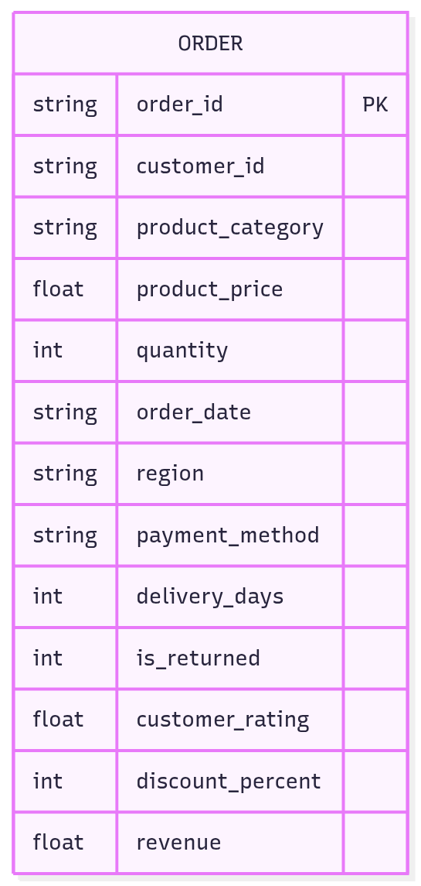

# E-commerce Dashboard (IN DEVELOPMENT)

### Background

Jumbo is a sample global e-commerce company. The company has data on sales that is underutilised after transactional processing. This project analyses sales data for the Head of Global Operations in order to improve global operations.

Insights and recommendations are provided in the following areas:

-   **Sales Trend Analysis**: Average Order Value (AOV) and Net Revenue being looked at
-   **Average Delivery Time**: Seeing if a certain _product category_ and/or _region_ affects this and seeing where to optimise
-   **Return Rate**: Seeing if a certain _product category_ and/or _region_ affects this and seeing where to optimise
-   **Correlations**: Correlation between Customer satisfaction and Delivery Time

Dashboard here
SQL queries here

-   DDL
-   ETL
-   Analysis

### Data Structure Overview

Rows: 100,000

<figure>
    
    <figcaption>ERD diagram of data</figcaption>
</figure>

Checks were done on the data using SQL here

### Executive Summary

#### Overview

short paragraph

Link dashboard

### Insights -> Recommendations

| Insights                                                                                           | Recommendations                                                        |
| :------------------------------------------------------------------------------------------------- | :--------------------------------------------------------------------- |
| _Return rate_ for fashion items (~12%) is almost double compared to other product categories (~6%) | <ul><li>Find a way to verify size before sedning the package</li></ul> |
| _Average Delivery Time_ and _CSAT_ have no correlation. CSAT remains the same across               | No recommendations                                                     |

-   add images here

-   specifics here
    -   quantified value
    -   business metric
    -   story in historical trend
    -   maybe add few visualisation

Other

The dashboard is specifically designed to answer the following executive-driven diagnostic questions:

### Caveats and Assumptions

##### Executive Business Questions

| Question                                                                                              | Visual Aid                          | Actionable Outcome                                                                      |
| :---------------------------------------------------------------------------------------------------- | :---------------------------------- | :-------------------------------------------------------------------------------------- |
| 1. Which **Product/Region Category** is the largest share of the **MoM increase in the Return Rate**? | Heatmap / Bar Chart                 | Immediate investigation into supplier, quality control, or packaging.                   |
| 2. Which **Region/Product Category** has a **poor Average Delivery Rate**?                            | Line Chart (Trend) / Map            | Carrier performance review and resource re-allocation (staffing/inventory).             |
| 3. Which **Product Category/Region** has a **certain AOV**?                                           | Multiple Line Chart (Trend) / Table | Guidance to Sales/Marketing on AOV-boosting strategies (e.g., free shipping threshold). |
| 4. What is the **correlation of MoM AOV and MoM Net Revenue**?                                        | Scatter Plot / Dual-Axis Chart      | Diagnosis of revenue growth _quality_ (volume vs. value).                               |
| 5. What is the **correlation between Delivery Time and CSAT**?                                        | Scatter Plot                        | Defines the maximum acceptable Service Level Agreement (SLA) for delivery days.         |

#### Dashboard

##### KPIs wiht their MoM percentage

-   Net Revenue
-   Average Order Value
-   Return Rate
-   Average Delivery Time
-   CSAT

##### Graphs

-   Sales Trend Analysis - Line Graphs (Actual Value, MoM on hover)
    -   MOM Net Revenue VS MOM AOV
    -   MoM Return Rate (Multi line chart)
        -   Region
        -   Product Category
    -   MoM Average Delivery Time (Multi line chart)
        -   Region
        -   Product Category
-   Return Rate & Average Delivery Time
    -   by Product Category - Bar Graph
    -   by Region - Continental Heatmap
-   Delivery Time VS CSAT - Scatter Plot

##### Regional Dashboards

-   You tick what you want to see. For later project
