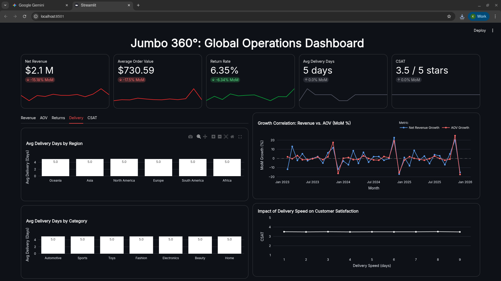
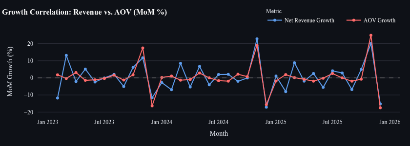
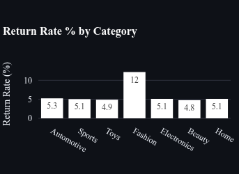
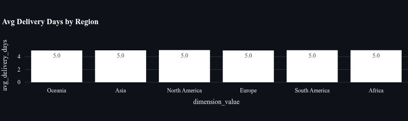
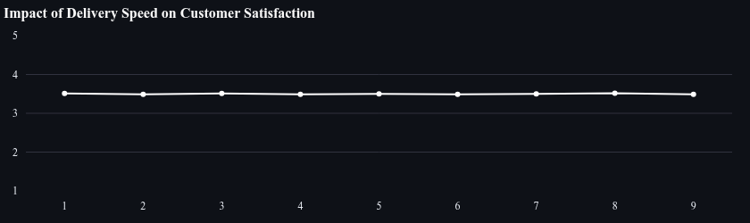

# Jumbo Global Operations Dashboard

<figure>
    
    <figcaption>Screenshot of <a href="https://ecommerce-sales-analysis.streamlit.app/">Jumbo Global Operations Dashboard</a></figcaption>
</figure>

---

### Project Background

Jumbo is a sample global e-commerce company. The company has data on sales that is underutilised after transactional processing. This project analyses sales data for the Head of Global Operations in order to improve global operations.

Insights and recommendations are provided in the following areas:

-   **Sales Trend Analysis**: Monitoring Net Revenue and AOV stability to ensure growth is driven by genuine demand, not just discounting.
-   **Delivery Optimization**: breaking down Average Delivery Time by Region to pinpoint specific territories where carrier performance is lagging.
-   **Margin Protection**: Analyzing Return Rate by Product Category to identify specific items (e.g., Fashion) that are eroding profits.
-   **Service Level Analysis**: Testing the correlation between Delivery Speed and CSAT to determine if faster shipping actually improves customer loyalty.

SQL queries for [DDL](/sql/ddl.sql), [Data Cleaning and Augmentation](/sql/cleaning.sql) and [ETL](/sql/etl.sql). Find the dashboard [here](https://ecommerce-sales-analysis.streamlit.app/)

---

### Data Structure Overview

Rows: 100,000

<figure>
    
    <figcaption>ERD diagram of data</figcaption>
</figure>

---

### Executive Summary

#### 1. Net Revenue & AOV Seasonal Spike

**Insight**  
Both _Net Revenue_ and _AOV_ spike by `~20%` in November, drop by `~20%` in December, then return to normal `~10%` MoM growth in January.

**Visualization**  

**Recommendations**

-   Pivot December ads to **Gift Cards** & **Express Shipping** for last-minute shoppers
-   Offer **bundle-only deals** in November to maximize natural AOV uplift
-   Run a **New Year retention campaign** targeting November one-time buyers
-   Increase warehouse staffing in early January to handle **return volume**

#### 2. High Fashion Return Rate

**Insight**  
Fashion items have a `~12%` _return rate_, almost double other categories (`~6%`).

**Visualization**  

**Recommendations**

-   Add **AI sizing tools** or “True-to-Fit” reviews
-   Provide high-resolution **fabric close-ups** to set better expectations

#### 3. Delivery Time Consistency Across Regions

**Insight**  
_Average delivery time_ is the same across all regions at `~5 days`.

**Visualization**  

**Recommendations**

-   Market your **“Consistent Global Delivery”** as a value proposition
-   Evaluate the ROI of **local warehousing** vs. your already efficient central hub

#### 4. No Correlation Between Delivery Time & CSAT

**Insight**  
_CSAT_ remains around `3.5/5`, regardless of how fast orders are delivered.

**Visualization**  

**Recommendations**

-   Shift from fast shipping to **economy shipping** to reduce logistics cost
-   Reinvest savings into **Quality Control**, especially for fashion SKUs

---

### Caveats and Assumptions

-   _Single-Item Orders_: Each order consists of only one distinct product type, limiting basket analysis or cross-selling insights.
-   _No Recurring Customers_: Each Customer ID appears only once, making Customer Lifetime Value (CLV) or retention analysis impossible.
-   _Revenue Focus_: Cost of Goods Sold (COGS) and shipping costs are missing, so analysis focuses on Top-line Revenue, not Net Profit.
-   _Broad Categorization_: Products are grouped into high-level categories (e.g., "Fashion"), masking performance differences of specific SKUs.
-   _Binary Returns_: Returns are flagged simply as "Yes/No" without specific return reasons or timestamps.
-   _Single Currency_: All financial values are assumed to be in a single currency (e.g., USD) with no exchange rate fluctuations.
-   _Delivery Calculation_: Delivery days are treated as calendar days from the moment of order placement to final delivery.
