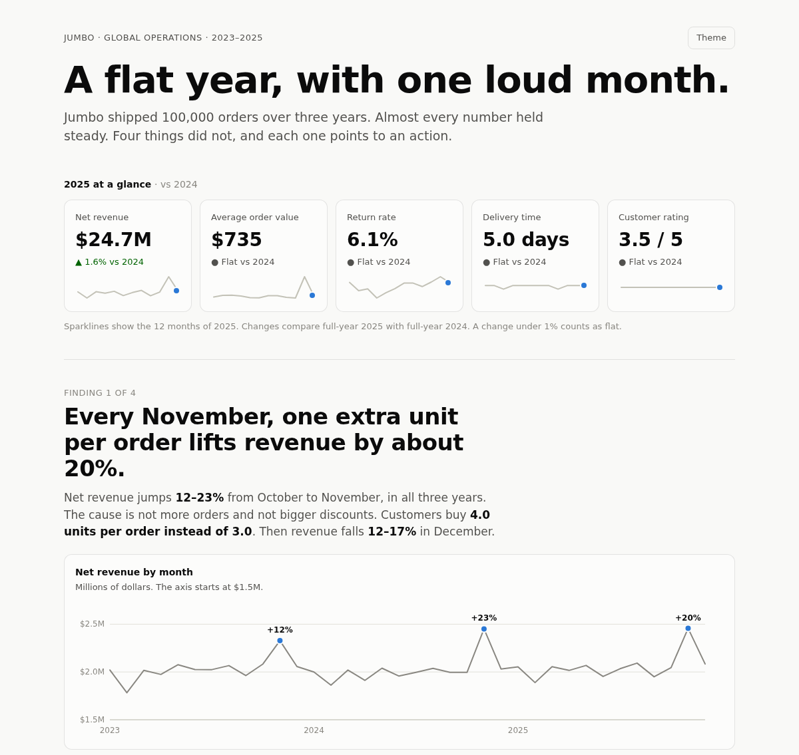
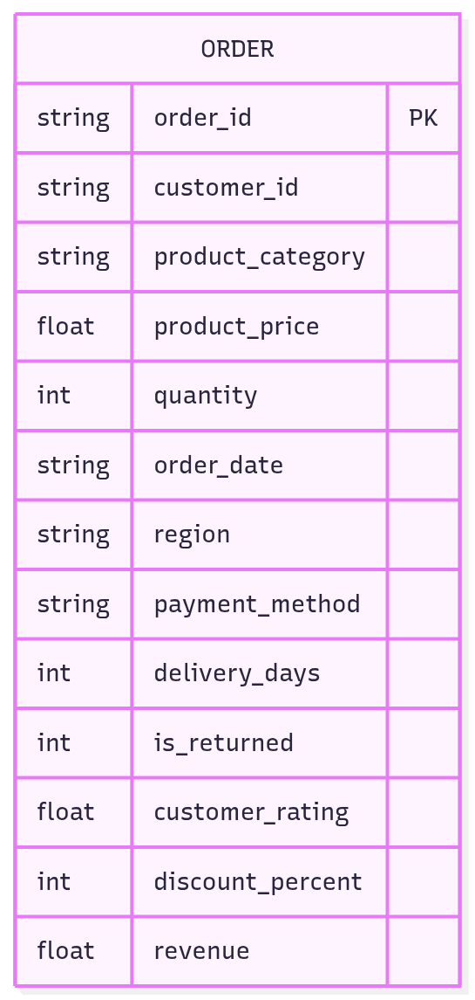

# Jumbo Global Operations: a data story

<a href="https://kraigochieng.github.io/ecommerce-sales-analysis/">
    
</a>

**[Read the story](https://kraigochieng.github.io/ecommerce-sales-analysis/)**: every chart carries its own insight and recommendation.

---

### Project Background

Jumbo is a sample global e-commerce company. Its sales data is underused after transaction processing. This project analyses 100,000 orders (2023–2025) for the Head of Global Operations, and turns them into actions.

Four findings, each with a chart and recommendations on the page:

1. **November:** one extra unit per order lifts revenue by about 20% every year. Orders and discounts stay flat.
2. **Fashion returns:** 12.2% of Fashion orders come back, 2.4 times the rate of other categories. The gap holds in every region.
3. **Delivery:** 5 days in every region. No region lags.
4. **Customer rating:** flat at 3.5 out of 5, whatever the delivery time. Faster shipping does not buy happier customers.

The page also lists the data caveats, such as one item per order and no cost data.

---

### Data Structure Overview

Rows: 100,000

<figure>
    
    <figcaption>ERD diagram of data</figcaption>
</figure>

SQL for [DDL](/sql/ddl.sql), [data cleaning and augmentation](/sql/cleaning.sql), [EDA](/sql/eda.sql) and [ETL](/sql/etl.sql).

---

### Run it locally

```sh
uv run setup-db       # build the SQLite database from the CSV
uv run export-story   # write the chart data to site/data/*.json
python3 -m http.server 8000 --directory site
```

Then open <http://localhost:8000>. Pushes to `main` rebuild and publish the page with GitHub Actions.

_For database setup and technical decisions, see [ENGINEERING.md](/ENGINEERING.md)._
